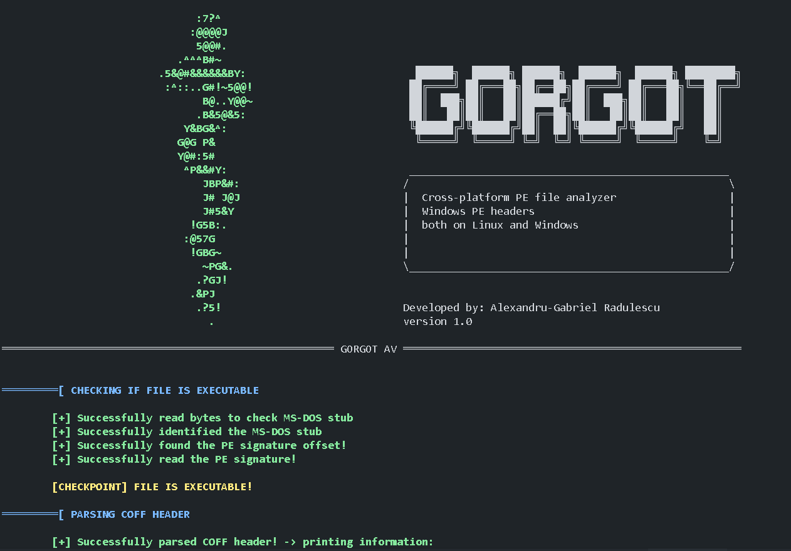
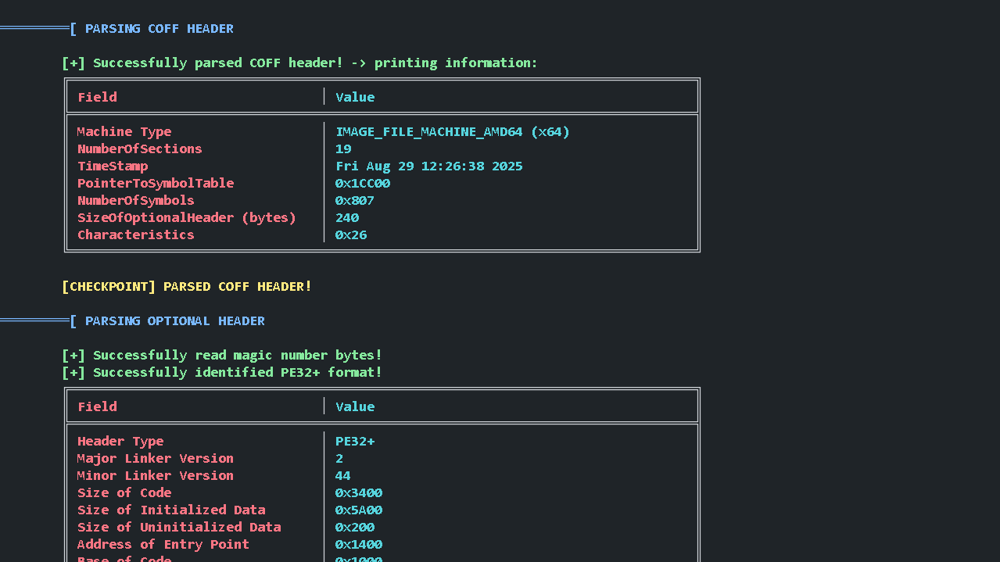
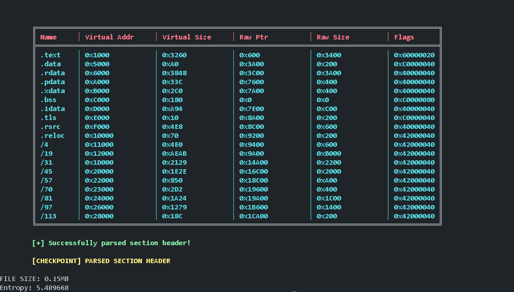

# file_analyzer

C-based program that parses the PE (Portable Executable) header of a file and prints detailed information about it.  

**Status:** In development  

---

## Features & Roadmap

Currently, the tool can read and analyze PE headers. Future enhancements include:  

- **Section analysis**: Flagging unusual section characteristics (e.g., any section besides `.text` marked as executable).  
- **Entropy calculation**: Section-based entropy to detect packed or obfuscated content.  
- **Hash computation**: MD5 and SHA256 hashes stored in a local database with classification flags (Suspicious, Malicious, Clean).  
- **YARA rules**: String and byte pattern matching for malware detection.  
- **CTI sharing**: Reporting findings in TLP-compliant, shareable formats.  
- **Cross-platform support**: Currently tested on Windows and Ubuntu, with ongoing work to improve compatibility.  

**Long-term goal:** Develop this into a lightweight antivirus in C that uses its own rules and techniques to classify files (not just a Python script that's written in C), offering analysts detailed insights. Advanced AV features like memory scanning will be added over time.  

---

## Prerequisites

- **CMake** (minimum version 3.28.3)  
- **GCC** (GNU Compiler Collection) or compatible C compiler  

---

## Compilation

```bash
mkdir build
cd build
cmake ..
cmake --build .
```

# Usage
```bash
./file_analyzer sample.exe -e
```

# Examples



